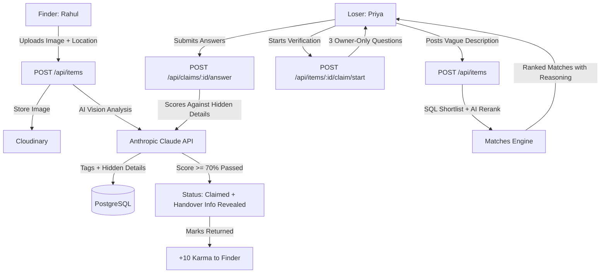

# BackToYou (Campus Lost & Found) - Complete System Overview

> **An AI-powered, privacy-first, anti-fraud campus lost & found platform built for university communities.**

---

## 1. Executive Summary

**BackToYou** solves the chronic inefficiency and fraud risks in university lost-and-found processes. Built with a **hardened Node.js/Express backend**, **PostgreSQL database (Neon / raw SQL)**, **Anthropic Claude AI integration**, and a **minimalist, responsive React frontend (Tailwind CSS + Leaflet)**.

The system incorporates **AI-assisted image tagging**, **bidirectional similarity matching**, and an **anti-fraud verification challenge** where the AI poses questions based on hidden item details to verify rightful ownership before contact info is shared.

---

## 2. Technology Stack

| Layer | Technologies Used | Key Responsibilities |
| :--- | :--- | :--- |
| **Backend** | Node.js (ES Modules), Express 4 | RESTful API, parameterized SQL queries, security middleware |
| **Database** | PostgreSQL (Neon / Local PG), `pg` driver | Raw SQL, GIN indexes on tags, composite indexes, JSONB for hidden details |
| **AI Layer** | `@anthropic-ai/sdk` (`claude-sonnet-5-5`) | Image metadata extraction, candidate re-ranking, 3 verification questions, answer scoring |
| **Auth** | Clerk (`@clerk/express`, `@clerk/clerk-react`) + Mock Mode | Domain restriction (`@sitnagpur.siu.edu.in`), instant local mock fallback |
| **Storage** | Multer (memory), Cloudinary API | 5MB limit, image-only validation, auto-transformation, fallback handling |
| **Security** | Helmet, CORS, Express-Rate-Limit, Zod | 100 req/min global, 10 req/min AI endpoints, strict schema validation |
| **Frontend** | React 18, Vite, Tailwind CSS, React Router v7 | Responsive design, zero-animation lightweight UI, Leaflet geospatial map |

---

## 3. Architecture & Core Innovations



### 3.1. Anti-Fraud & Privacy Architecture
1. **Photo Withholding for Found Items**:
   - The public feed and public item detail endpoints **never return `image_url` for found items**; they return `has_image: true`.
   - This prevents dishonest users from claiming items by merely looking at uploaded photos.
2. **Hidden Details (JSONB)**:
   - AI extracts features only the owner would know (e.g., *scratches on corner, specific stickers, contents inside case*).
   - `hidden_details` is **never queried or returned** by public endpoints (verified by `npm run test:leak`).
3. **AI Verification Gateway**:
   - Generates 3 non-public questions.
   - Requires $\ge 70\%$ score to pass.
   - Max 3 attempts allowed per claimant per item before permanent lockout.
4. **Karma Incentives**:
   - Status transitions strictly enforce: `open` $\rightarrow$ `at_desk` $\rightarrow$ `claimed` $\rightarrow$ `returned`.
   - On `returned`, $+10$ karma points are awarded to the finder.

---

## 4. Complete Feature Breakdown

### 4.1. Intelligent Matching Engine (`matching.js`)
- **Step 1 (SQL Shortlist)**: Filters opposite-type items where `status = 'open'` ranked by category match, color match, and PostgreSQL tag array overlap (`tags && $tags`), capped at `LIMIT 5`.
- **Step 2 (AI Re-ranking)**: Passes candidate metadata to Claude to score $0\text{–}100$ and generate human-readable explanations (e.g., *"Same black charging case found near Library stairs 30 mins after reported lost"*).
- **Reverse Matching**: When a found item is posted, open lost items are automatically matched and stored.

### 4.2. Claim Verification Flow (`claims.js`)
- `POST /api/items/:id/claim/start`: Generates 3 challenge questions from `hidden_details`. Prevents users from claiming items they posted.
- `POST /api/claims/:id/answer`: Claude evaluates answers against ground-truth hidden details (lenient on phrasing/synonyms, strict on facts). On passing, transitions status to `claimed` and reveals finder contact details.

### 4.3. Campus Hotspots Map (`Hotspots.jsx`)
- Aggregates lost item occurrences by campus building (`Library`, `Canteen`, `Lab 3`, `Sports Ground`, `Hostel Block A`, `Main Building`).
- Visualized on an interactive **Leaflet OpenStreetMap** with radius-proportional circle markers showing high-frequency loss zones.

### 4.4. Dual Auth Mode (Seamless Development + Production)
- **Production Mode**: Full Clerk authentication using JWTs, auto-provisioning user records on first login, and optional college domain restrictions (e.g., `@sitnagpur.siu.edu.in`).
- **Mock Mode**: Auto-activates if Clerk keys are missing or placeholders. Provides a mock auth dropdown in the navbar allowing instant switching between **User 1 (Rahul)**, **User 2 (Priya)**, and **User 3 (Arjun)** to test end-to-end multi-user handovers.

---

## 5. API Reference Summary

| Method | Endpoint | Access | Purpose |
| :--- | :--- | :--- | :--- |
| `GET` | `/api/health` | Public | Healthcheck and database wake-up (`SELECT 1`) |
| `GET` | `/api/items` | Public | Public feed with search (`q`), category, type, and location filters |
| `GET` | `/api/items/:id` | Public | Public item detail with sanitized projection |
| `POST` | `/api/items` | Protected | Create lost/found item with image upload & AI tagging |
| `GET` | `/api/items/:id/matches` | Owner Only | Get AI-ranked potential matches with reasons |
| `POST` | `/api/items/:id/claim/start` | Protected | Initialize claim and receive 3 verification questions |
| `POST` | `/api/claims/:id/answer` | Claimant Only | Submit answers, score verification, reveal handover info |
| `PATCH` | `/api/items/:id/status` | Finder/Admin | Transition status (`open` $\rightarrow$ `at_desk` $\rightarrow$ `claimed` $\rightarrow$ `returned`) |
| `GET` | `/api/stats/hotspots` | Public | Location groupings with count and average lat/lng |
| `GET` | `/api/me` | Protected | Current user profile, karma score, posts, and claims |

---

## 6. Verification & Automated Test Suite

### 6.1. Security Leak Test (`testLeak.js`)
Tests all public endpoints against data leakage:
```bash
npm run test:leak
```
```text
✅ Health check
✅ Items feed (all)
✅ Items feed (found only)
✅ Items feed (lost only)
✅ Single item (ID 1)
✅ Single item (ID 6)
✅ Hotspots
==================================================
✅ All tests passed! (No hidden_details, emails, or raw found images exposed)
```

### 6.2. Production Build Check
```bash
cd client && npm run build
```
```text
✓ 151 modules transformed.
✓ built in 4.62s
dist/assets/index.js   449.96 kB
dist/assets/index.css   30.08 kB
```

---

## 7. Project File Structure

```text
campus_lost_found/
├── package.json                 # Monorepo root scripts (dev, db:reset, test:leak)
├── WHAT_WE_BUILT.md             # This document
├── README.md                    # Quick overview and documentation
├── TEST_COMMANDS.md             # Complete curl testing cheat sheet
├── server/
│   ├── .env                     # Server environment variables
│   ├── src/
│   │   ├── index.js             # Express application & middleware setup
│   │   ├── middleware/
│   │   │   └── auth.js          # Unified Clerk / Mock authentication middleware
│   │   ├── routes/
│   │   │   ├── items.js         # Item CRUD, AI matching triggers, claim start
│   │   │   ├── claims.js        # Answer submission & verification scoring
│   │   │   ├── stats.js         # Hotspot aggregation endpoints
│   │   │   └── user.js          # /me profile & karma endpoint
│   │   ├── services/
│   │   │   ├── ai.js            # Claude SDK (tagging, rerank, questions, scoring)
│   │   │   ├── matching.js      # SQL shortlist & AI reranking engine
│   │   │   └── cloudinary.js    # Image upload with memory storage & fallback
│   │   └── utils/
│   │       ├── db.js            # PostgreSQL connection pool with SSL handling
│   │       ├── errors.js        # Central AppError & standardized error handler
│   │       └── logger.js        # Request logger
│   ├── db/
│   │   ├── schema.sql           # DDL: users, items, claims, matches, indexes
│   │   └── seed.sql             # 14 realistic campus items across 6 locations
│   └── scripts/
│       ├── resetDb.js           # Database reset & seed runner
│       └── testLeak.js          # Data leakage automated test runner
└── client/
    ├── .env                     # Client environment variables
    ├── index.html               # Entry HTML with Leaflet CSS
    ├── src/
    │   ├── main.jsx             # React entry point wrapped with AuthProvider
    │   ├── App.jsx              # Navigation and client routes
    │   ├── auth/
    │   │   └── clerk.jsx        # Dual-mode Clerk & Mock AuthProvider bridge
    │   ├── pages/
    │   │   ├── Feed.jsx         # Public filterable card feed
    │   │   ├── PostItem.jsx     # Multipart item post form with tag preview
    │   │   ├── ItemDetail.jsx   # Item detail with verified photo badges & actions
    │   │   ├── Matches.jsx      # Owner-only ranked candidate matches
    │   │   ├── Claim.jsx        # Interactive 3-question verification wizard
    │   │   ├── Profile.jsx      # User profile, karma tracker, posts & claims
    │   │   └── Hotspots.jsx     # Interactive Leaflet campus heatmap
    │   └── utils/
    │       └── api.js           # Authenticated API fetch wrapper
```

---

## 8. Quick Commands Reference

```powershell
# 1. Reset & Seed DB
npm run db:reset

# 2. Run Security Leak Test
npm run test:leak

# 3. Start Backend Server (port 4000)
npm run dev:server

# 4. Start Frontend Client (port 5173)
npm run dev:client
```
